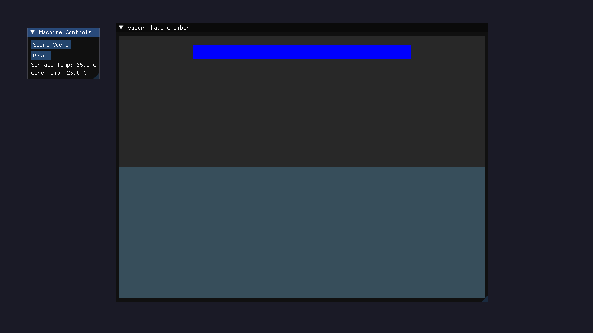
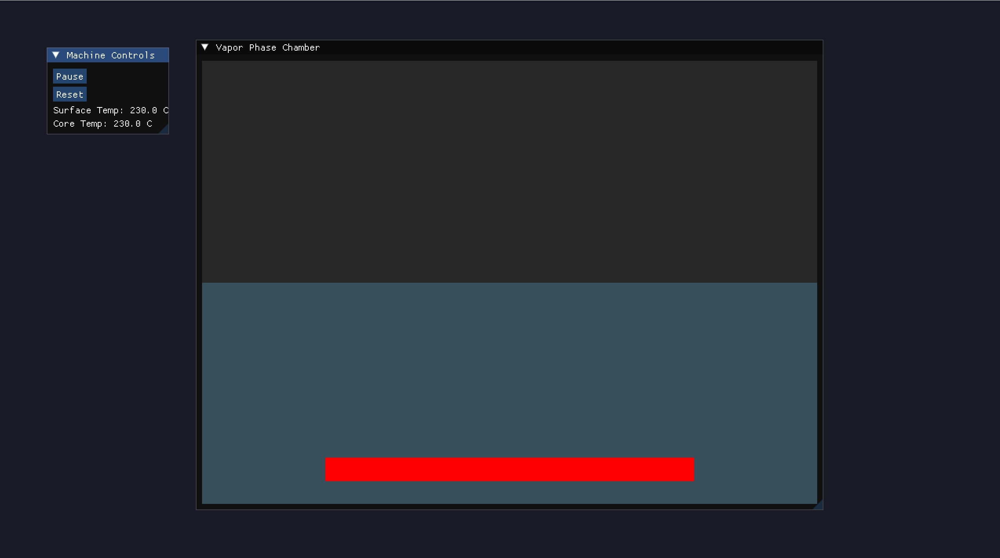

# Vapor Phase Soldering (VPS) 2D Simulator

A real-time 2D thermal simulation of **Vapor Phase Soldering (VPS)**, developed in C++ to model the heating and cooling of a PCB immersed in Galden vapor.

The simulator combines a **1D explicit Finite Difference Method (FDM)** thermal solver with a kinematic model of the VPS chamber, allowing the effect of PCB immersion depth and heat-transfer conditions to be visualized in real time.

The project is designed as a lightweight engineering simulation tool, with the physics engine separated from the graphical interface to make the thermal model easier to develop, test, and extend.

## ✨ Features

### 🌡️ Thermal Simulation

* Explicit **1D Finite Difference Method (FDM)** heat solver.
* Calculates temperature evolution through the PCB thickness.
* Models heat conduction using material properties such as:

  * Thermal conductivity
  * Density
  * Specific heat capacity
* Separate surface and core temperature evolution.
* Real-time temperature updates during the simulation.

### ♨️ VPS Reflow Profile

The simulator implements an automated reflow-profile state machine consisting of:

* **Preheat**
* **Soak**
* **Reflow**
* **Cooling**

The controller dynamically adjusts the simulated PCB position and heat-transfer conditions throughout the process.

### 🏗️ VPS Chamber & Kinematics

* Simulated PCB elevator movement.
* Adjustable immersion depth.
* Dynamic convection/condensation heat-transfer coefficient.
* Automatic movement between profile stages.
* Real-time visualization of the PCB inside the vapor chamber.

### 🎨 Real-Time Visualization

* Hardware-accelerated rendering using **OpenGL 3**.
* Immediate-mode GUI using **Dear ImGui**.
* Interactive simulation parameters.
* Live temperature readouts.
* Color-mapped thermal gradient across the PCB cross-section.

---

## 📸 Illustration

|                          Machine Controls & UI                         |                      Vapor Phase Thermal Simulation                      |
| :--------------------------------------------------------------------: | :----------------------------------------------------------------------: |
|                          |                           |
| *Interactive controls, profile parameters and live state information.* | *Real-time visualization of PCB immersion and temperature distribution.* |

---

## 🧠 How It Works

The simulator models the PCB as a one-dimensional thermal system through its thickness.

The PCB is discretized into a series of temperature nodes:

```text
        PCB
 ┌───────────────────┐
 │ T₀  ← Surface     │
 │ T₁                 │
 │ T₂                 │
 │ ⋮                  │
 │ Tₙ₋₁               │
 │ Tₙ  ← Surface     │
 └───────────────────┘
```

Heat conduction between neighboring nodes is calculated using an explicit finite-difference formulation of the heat equation.

For an internal node:

[
T_i^{n+1}
=========

T_i^n
+
\alpha \frac{\Delta t}{\Delta x^2}
\left(
T_{i+1}^n - 2T_i^n + T_{i-1}^n
\right)
]

where:

* (T_i) is the temperature of node (i)
* (\alpha) is the thermal diffusivity
* (\Delta t) is the simulation timestep
* (\Delta x) is the distance between nodes

The boundary conditions are influenced by the surrounding vapor environment and the current VPS process stage.

### Simulation Flow

```text
        Reflow Profile
              │
              ▼
      Profile State Machine
              │
       ┌──────┴──────┐
       │             │
       ▼             ▼
 PCB Position      Heat Transfer
       │             │
       └──────┬──────┘
              ▼
       Thermal Solver
              │
              ▼
       Temperature Nodes
              │
              ▼
       Live Heatmap / GUI
```

This separation allows the thermal solver to operate independently from the visualization and profile-control systems.

---

## 🏗️ Project Architecture

The project follows a modular C++ architecture separating the **physics**, **process control**, and **graphical interface**.

```text
vps-simulator/
│
├── CMakeLists.txt
│
├── external/
│   └── imgui/                  # Dear ImGui
│
├── include/
│   └── vps/
│       ├── physics/
│       │   └── HeatSolver.hpp
│       │
│       └── profile/
│           └── ReflowProfile.hpp
│
├── src/
│   ├── physics/
│   │   └── HeatSolver.cpp
│   │
│   ├── profile/
│   │   └── ReflowProfile.cpp
│   │
│   └── main.cpp
│
└── docs/
    ├── screenshot_controls.png
    └── screenshot_chamber.png
    (Other documentation)
```

### Main Components

**`HeatSolver`**

Responsible for the thermal simulation and numerical solution of the heat equation.

**`ReflowProfile`**

Controls the VPS process state machine, including heating stages, elevator movement, and heat-transfer parameters.

**`main.cpp`**

Handles:

* GLFW window creation
* OpenGL initialization
* Dear ImGui setup
* User interface
* Simulation loop
* Thermal visualization

---

## 🛠️ Technologies

| Technology     | Purpose                              |
| -------------- | ------------------------------------ |
| **C++17**      | Core application and simulation      |
| **CMake**      | Build system                         |
| **OpenGL 3**   | Hardware-accelerated rendering       |
| **GLFW**       | Window and OpenGL context management |
| **Dear ImGui** | Graphical user interface             |
| **FDM**        | Numerical thermal simulation         |

---

## 📦 Dependencies

* C++17-compatible compiler
* CMake 3.10+
* OpenGL 3.0+
* GLFW3
* Dear ImGui
* Git

### Linux / WSL2

Install the required system packages:

```bash
sudo apt update

sudo apt install \
    build-essential \
    cmake \
    git \
    libglfw3-dev \
    libgl1-mesa-dev \
    xorg-dev
```

---

## 🚀 Building

### 1. Clone the repository

```bash
git clone --recursive https://github.com/clementora/vps-simulator.git

cd vps-simulator
```

If the repository has already been cloned without submodules:

```bash
git submodule update --init --recursive
```

### 2. Configure the project

```bash
mkdir build
cd build

cmake ..
```

### 3. Compile

```bash
make -j$(nproc)
```

### 4. Run

```bash
./VPSSimulator
```

---

## 🎛️ Simulation Parameters

The simulator provides interactive controls for adjusting parameters such as:

* PCB thickness
* Thermal conductivity
* Density
* Specific heat capacity
* Simulation timestep
* Vapor temperature
* Heat-transfer coefficient
* Elevator position
* Reflow-stage durations
* Target temperatures

These parameters can be modified during runtime to observe their influence on the simulated thermal profile.

---

## ⚠️ Numerical Considerations

Because the thermal solver uses an **explicit finite-difference scheme**, the simulation timestep must satisfy the numerical stability condition associated with the discretized heat equation.

For the standard 1D formulation:

[
Fo = \frac{\alpha \Delta t}{\Delta x^2}
]

and stability generally requires:

[
Fo \leq \frac{1}{2}
]

where (Fo) is the Fourier number.

Using a timestep that is too large can cause numerical instability and produce non-physical temperature oscillations or divergence.

---

## 📄 License

This project is currently under development.

Add the appropriate license here when the project is ready for distribution.

---

